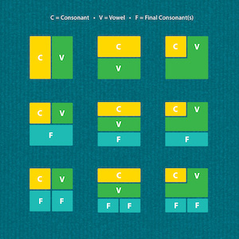

# Convert English to Korean Using Numbers

### Constrained Writing Techniques

For WEEK 1, in class we have explored differnet constrained writing technqiues - a literary technique in which writer is bound by some condition that forbids certain things or imposes a pattern. Some examples we looked at are the snowbal, lipogram, prisoner's constraint, palindromes, univocalism, and mathew's algorithm technqiques. 

### Ideation

As I am fluent in Englisha and Korean, I wanted to invent a constrained writing technique that involves English and Korean. I wanted to challenge coming up with a creative technique that converts English Roman Alphabets to Korean Hanguel Alphabets. 

Here are some thoughts and considerations I had as I was developing a system:

1) English has upper-and lower-case system - Korean doesn't.
2) Both English and Korean are written/read left to right.
3) Korean letters are written in syllable blocks.

4) "apostrophe" is used specifically for English but is never used in Korean.

Considereing these, I developed a technique that uses number to convert the Text written in English Roman alphabets to Korean Hangeul Text.

[Click to View the Project](https://soojin-lee0819.github.io/Constrained-Writing/)

### Evaluation & Reflection

Since this is merely a conversion of Roman Alphabets to Hangeul Alphabets with some patterns and rules, although the final text in Korean is legible, it is not intelligable. Regardless, it was fascinating to see how, the two very different language systems - English Roman alphabets and Korean Hangeul alphabets - can be converted to one another. 
